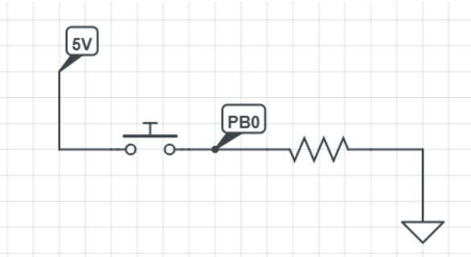
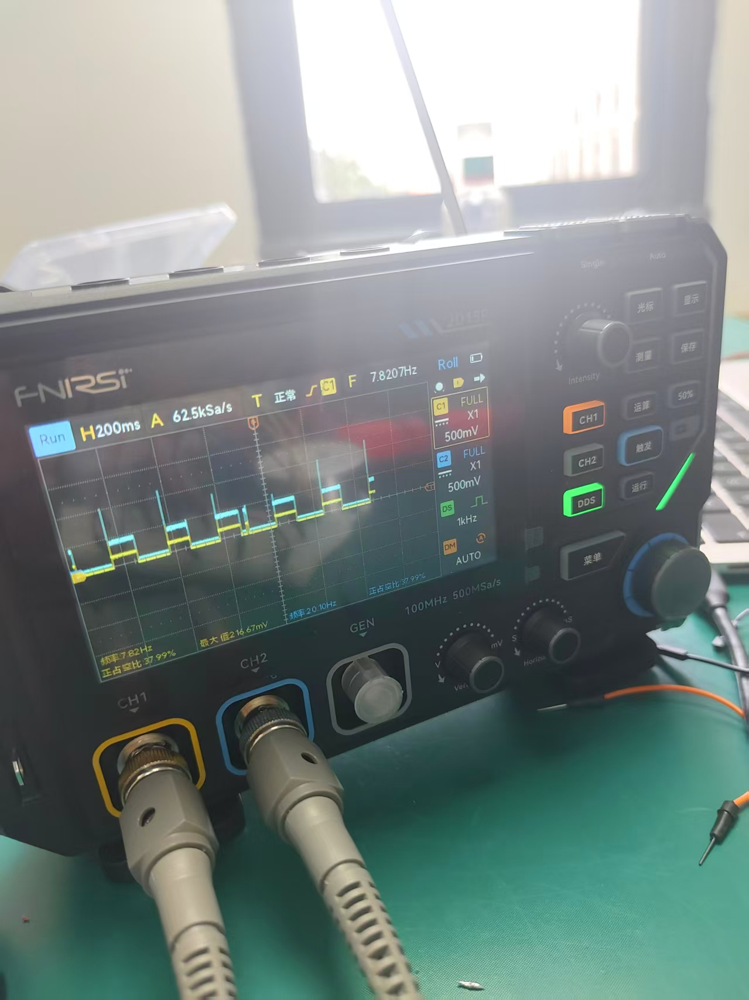
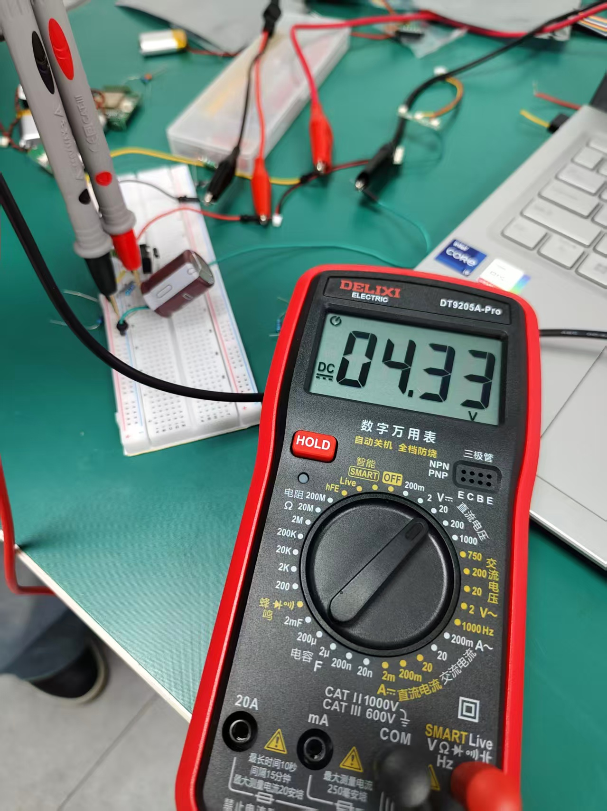

R1:"SOMEDAY I WILL BE COOL”

S1:

S2:

S3:

S4:

R2:Advantages:
• CPU is free to do other work; it only reacts when the button is pressed.
• Faster response — no delay between press and action.
• Saves power because the processor can sleep instead of running a busy loop.
Disadvantages:
• Code is harder to write and debug.
• Button bounce can cause multiple unwanted interrupts.
• Shared data between ISR and main code can cause bugs.

R3:50 ms = 12,500 ticks
• 200 ms = 50,000 ticks
• 400 ms = 100,000 ticks

R4:A prescaler acts like a gearshift for the timer. It slows down the counting speed by dividing the system clock, so the same 16-bit timer can measure both very short events (microseconds) and very long events (seconds). Without it, the timer would overflow too quickly for long delays or be too coarse for precise timing.

R5: 

L1:

L2:

L3:

R6:10nF is better.
A larger capacitor charges more slowly, so it smooths out the rapid voltage spikes caused by switch bounce. With 1nF, the capacitor reacts too fast and the bouncing still gets through. With 10nF, the output rises gently to 5V, giving the microcontroller one clean press instead of multiple false triggers.

V1: [2135736905.mp4](2135736905.mp4)

V2: [1776219773.mp4](1776219773.mp4)